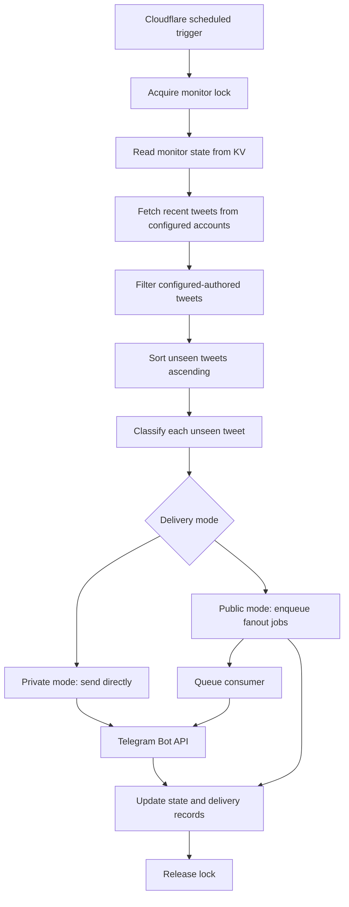

# Architecture

## Goal

Build a small Telegram alert bot that watches configured X/Twitter accounts and sends a Telegram message whenever a new authored tweet appears. Each alert includes an AI classification of whether the tweet indicates a Codex/ChatGPT rate-limit reset.

This project is inspired by `jskoiz/has-codex-rate-limits-reset-today`, but it intentionally does not build a public website or admin UI. The reference project's useful pieces are the tweet polling, tweet watermarking, cautious classification prompt, and structured AI verdicts. This project replaces the website state update with Telegram delivery.

## Deployment Pick

Deploy on the Cloudflare Workers stack. The private/small v1 can use one Worker with a scheduled cron trigger and Workers KV for monitor state. If the bot becomes public, add D1 for subscriptions, Cloudflare Queues for Telegram fanout, and a Durable Object for consistent rate limiting.

Why this is the right default:

- The bot is an outbound scheduled job, not an always-on chat server.
- Cloudflare scheduled triggers remove the need for a VPS, systemd, Docker host, or background process manager.
- Workers KV is enough for the small amount of monitor state: last seen tweet ID, recent decisions, and last error.
- D1 is a better fit than environment variables for a large subscriber list.
- Cloudflare Queues decouple tweet detection from Telegram delivery when many chats need the same alert.
- Durable Objects provide strong inbound rate limiting if Telegram commands become public and high-volume.
- Telegram delivery uses simple HTTPS calls to the Telegram Bot API.
- OpenRouter classification uses HTTPS and does not require local compute.
- The project stays cheap and low-ops while still being deployable from a normal GitHub repository.

Rejected defaults:

- A public website like the reference project: unnecessary because Telegram is the product surface.
- A long-running Node server on a VPS: more operational burden than a cron-style bot needs.
- GitHub Actions cron: easy to start, but scheduled runs can be delayed or disabled, and durable state usually means noisy commits or awkward artifacts.
- A database for private v1: overkill for a small configured account list and a small fixed chat list.

## High-Level Flow



## Runtime Components

### Scheduled Worker

The Worker is the only runtime process. It has two entry points:

- `scheduled(event, env, ctx)`: production cron path.
- `fetch(request, env, ctx)`: manual operations such as `/health` and authenticated `/run`.

The scheduled path should run every hour by default. That is frequent enough for useful alerts while staying gentle on tweet-provider and OpenRouter usage.

### Tweet Provider

The tweet provider fetches recent posts from configured accounts and normalizes them into the app's internal tweet shape.

The reference project uses `rettiwt-api` and combines search plus timeline/replies fallback. This project keeps the same idea behind a `TweetProvider` module so the source can be swapped if X/Twitter access changes. The implementation uses this source order: custom `TWEET_PROVIDER_URL`, Nitter RSS, then `rettiwt-api` guest/user fallback with Cloudflare `nodejs_compat`.

Internal tweet shape:

```ts
type Tweet = {
  id: string;
  url: string;
  createdAt: string;
  fullText: string;
  authorUsername: string;
  isRetweet: boolean;
  isReply: boolean;
  quotedText?: string | null;
  quotedUrl?: string | null;
  quotedCreatedAt?: string | null;
};
```

Fetching rules:

- Fetch only recent tweets, usually the last 24 hours.
- Keep only tweets authored by configured target usernames.
- Keep retweets/reposts, replies, and quote tweets because any of them can be the latest account activity and can contain reset signals.
- Deduplicate by tweet ID.
- Sort oldest to newest before processing so alerts arrive in chronological order.

### State Store

Workers KV stores a single JSON document under a key such as `monitor-state`.

```json
{
  "lastSeenTweetId": "1950000000000000000",
  "lastSeenTweetUrl": "https://x.com/thsottiaux/status/1950000000000000000",
  "lastCheckAt": "2026-07-07T12:00:00.000Z",
  "lastError": null,
  "recentDecisions": [
    {
      "tweetId": "1950000000000000000",
      "tweetUrl": "https://x.com/thsottiaux/status/1950000000000000000",
      "tweetCreatedAt": "2026-07-07T11:58:00.000Z",
      "verdict": "not_reset",
      "confidence": 0.94,
      "rationale": "The post is unrelated to rate-limit resets.",
      "alertedAt": "2026-07-07T12:00:05.000Z"
    }
  ]
}
```

State rules:

- On first run, seed `lastSeenTweetId` with the newest authored tweet and do not alert historical tweets.
- In private direct-send mode, only advance `lastSeenTweetId` after classification and Telegram delivery succeed.
- In public queued-fanout mode, advance `lastSeenTweetId` only after the alert decision and delivery jobs are durably persisted.
- If a run fails before direct Telegram delivery or queue enqueue, leave the watermark unchanged so the tweet is retried.
- Keep a bounded `recentDecisions` list, for example the latest 50 entries.
- Store only the metadata needed for debugging; do not turn KV into an analytics database.

### Subscriber Store

For a private v1, configured `TELEGRAM_CHAT_IDS` are acceptable. For a bot used by many people, chat IDs should move into D1 so users can subscribe and unsubscribe without redeploying the Worker.

Suggested D1 tables:

```sql
create table telegram_subscriptions (
  chat_id text primary key,
  chat_type text not null,
  status text not null,
  subscribed_at text not null,
  unsubscribed_at text,
  failure_count integer not null default 0,
  last_delivery_error text,
  last_delivery_error_at text
);

create table telegram_deliveries (
  alert_id text not null,
  chat_id text not null,
  status text not null default 'pending',
  claimed_until text,
  attempt_count integer not null default 0,
  delivered_at text,
  error text,
  updated_at text not null,
  primary key (alert_id, chat_id)
);
```

Subscriber rules:

- `/subscribe` creates or reactivates a subscription for the current chat.
- `/unsubscribe` marks the current chat as unsubscribed.
- `/status` reads cached monitor state and does not call OpenRouter or the tweet provider.
- Permanent Telegram errors such as bot blocked or chat not found should disable the subscription.
- Store the minimum needed to deliver messages. Avoid storing names, profile data, or arbitrary chat text.
- Use `telegram_deliveries` only for idempotency and debugging; prune old rows on a schedule.

### Classifier

The classifier sends the normalized tweet to OpenRouter's Chat Completions API and receives a JSON verdict. The default model is a free OpenRouter model with a `:free` suffix, and `OPENROUTER_MODEL` should be updated if OpenRouter changes its free model availability.

Verdicts:

- `reset_confirmed`: the tweet or quoted tweet clearly says limits/caps/rate limits reset, were lifted, or usage is available again now.
- `not_reset`: the tweet is unrelated or does not indicate a current reset.
- `uncertain`: the tweet might be about a reset but is not explicit enough to treat as confirmed.

Response shape:

```ts
type Classification = {
  verdict: "reset_confirmed" | "not_reset" | "uncertain";
  confidence: number;
  rationale: string;
};
```

Classification policy:

- Prefer caution over false positives.
- Future reset discussion is not a current reset.
- If a quoted tweet provides the reset evidence, the rationale should say so.
- The rationale should be one short sentence because it appears in Telegram.
- Every new tweet gets classified and cached. Only `reset_confirmed` tweets trigger Telegram alerts.

### Telegram Notifier

Telegram is the user-facing product surface. The bot does not need Telegram webhooks for v1 because it only sends outbound messages.

Message template:

```text
@sama posted

Verdict: reset_confirmed
Confidence: 0.93
Reason: The quoted post says rate limits have reset now.

Tweet: https://x.com/thsottiaux/status/...

Text:
...
```

Notification rules:

- Send one Telegram message per unseen `reset_confirmed` tweet.
- Send to one or more configured chat IDs.
- Escape Markdown or use Telegram HTML parse mode carefully to avoid malformed messages.
- Truncate long tweet text to keep alerts readable.
- If Telegram returns a retryable error, fail the run before advancing the watermark.

### Telegram Defensive Design

The safest v1 posture is outbound-only. Do not configure a Telegram webhook and do not implement long polling for inbound updates. If many people message or spam the bot, those messages should not trigger tweet fetching, OpenRouter calls, state writes, or any other billable work.

If inbound commands are added later, the command surface must be intentionally small and defensive from day one.

Inbound webhook rules:

- Use a dedicated endpoint such as `POST /telegram/webhook`.
- Configure Telegram's webhook `secret_token` and reject requests unless `X-Telegram-Bot-Api-Secret-Token` matches.
- Use Telegram `allowed_updates` to receive only the update types the bot actually needs.
- Use `drop_pending_updates` during deploys so old spam does not replay after downtime.
- Return `200` for ignored or rate-limited updates so Telegram does not retry useless work.
- Ignore non-command text, media, stickers, forwarded messages, and large payloads.

BotFather settings:

- Keep group privacy enabled unless group support is explicitly required.
- Disable group joins if this bot only supports direct messages.
- Do not enable inline mode for v1.
- Publish only supported commands, for example `/status`, `/subscribe`, `/unsubscribe`, and admin-only `/run`.

Rate limiting:

- Keep cheap commands and expensive commands separate.
- Cheap commands such as `/status` should read cached KV state only.
- Expensive commands such as `/run` must be admin-only and protected by both bearer auth and chat allowlisting.
- Add per-user, per-chat, and global token buckets before any command can call external services.
- Suggested defaults: 20 cheap commands per chat per minute, 3 expensive commands per admin per hour, and 1 global tweet poll in flight.
- Use a Durable Object for rate limits and command locks if inbound usage becomes significant. KV is eventually consistent and is not a reliable high-concurrency rate limiter.
- Send one concise throttling response per cooldown window instead of replying to every spam message.

Cost and abuse controls:

- Never call OpenRouter based on arbitrary user text.
- Never fetch tweets directly from a public user command unless the caller is an authorized admin.
- Serve `/status` from the latest cached monitor state.
- Cap Telegram response length.
- Circuit-break external calls after repeated provider failures and expose the degraded state in `/health`.
- Treat chat IDs as subscriptions, not as permission to run privileged operations.

Webhook idempotency:

- Telegram may retry webhook deliveries, so store processed `update_id` values with a short TTL.
- Process each update at most once.
- Use message IDs or callback query IDs as secondary dedupe keys where useful.
- Do not let duplicate webhook deliveries duplicate subscriptions or trigger duplicate admin runs.

Broadcast fanout:

- Classify a tweet once per scheduled poll, then fan out the same decision to subscribed chat IDs.
- For a small private bot, direct sends from the scheduled Worker are acceptable.
- For a public bot, enqueue delivery jobs into Cloudflare Queues instead of sending every Telegram message inside the cron execution.
- Split delivery jobs into bounded batches, for example 50 to 100 chat IDs per queue message.
- The queue consumer should enforce a conservative global Telegram send rate and a per-chat cooldown.
- Use `alert_id = tweet_id + verdict` and the `telegram_deliveries` table to prevent duplicate sends.
- Track per-chat delivery failures and disable chats that repeatedly return permanent errors such as bot blocked or chat not found.
- Do not let one failing chat prevent delivery to other chats.
- If the queue backs up, keep accepting scheduled monitor results but report degraded delivery in `/health`.

The key product rule is that public Telegram traffic can read cached state or manage a subscription, but it cannot multiply tweet-provider calls, OpenRouter calls, or monitor runs.

### Manual Run and Health Endpoints

The Worker should expose a tiny authenticated maintenance surface:

- `GET /health`: returns basic service status and last check metadata.
- `POST /run`: requires `Authorization: Bearer <CRON_SECRET>` and triggers one poll immediately.

No public admin UI is planned for v1.

## Proposed Repository Structure

```text
.
├── architecture.md
├── package.json
├── wrangler.toml
├── src
│   ├── index.ts
│   ├── classifier.ts
│   ├── delivery-queue.ts
│   ├── env.ts
│   ├── http.ts
│   ├── monitor.ts
│   ├── rate-limit.ts
│   ├── state.ts
│   ├── subscriptions.ts
│   ├── telegram.ts
│   ├── tweets.ts
│   ├── types.ts
│   └── webhook.ts
└── tests
    ├── classifier.test.ts
    ├── monitor.test.ts
    ├── rate-limit.test.ts
    ├── state.test.ts
    ├── telegram.test.ts
    └── tweets.test.ts
```

## Environment Variables and Secrets

Cloudflare Worker secrets:

- `OPENROUTER_API_KEY`: OpenRouter API key for classification.
- `OPENROUTER_MODEL`: optional model override, defaulting to `nvidia/nemotron-3-super-120b-a12b:free`.
- `OPENROUTER_SITE_URL`: optional attribution URL sent to OpenRouter.
- `OPENROUTER_APP_NAME`: optional attribution title sent to OpenRouter.
- `TELEGRAM_BOT_TOKEN`: token from BotFather.
- `TELEGRAM_CHAT_IDS`: optional comma-separated chat IDs for private v1 or bootstrap notifications.
- `ADMIN_TELEGRAM_CHAT_IDS`: comma-separated chat IDs allowed to run admin-only commands.
- `TELEGRAM_WEBHOOK_SECRET`: secret token expected in `X-Telegram-Bot-Api-Secret-Token` if inbound webhooks are enabled.
- `RETTIWT_API_KEY`: optional Rettiwt user-auth API key; guest auth is used when omitted.
- `CRON_SECRET`: bearer token for manual `/run` calls.

Cloudflare bindings:

- `MONITOR_STATE`: Workers KV namespace for the state document and lock.
- `SUBSCRIPTIONS_DB`: optional D1 database for public subscription storage.
- `TELEGRAM_DELIVERY_QUEUE`: optional Cloudflare Queue for high-volume Telegram fanout.
- `RATE_LIMITER`: optional Durable Object binding for webhook command rate limits.

Non-secret config:

- `TARGET_USERNAME`: legacy single-account setting, defaults to `thsottiaux`.
- `TARGET_USERNAMES`: optional comma-separated monitored accounts. Production defaults to `thsottiaux,sama`.
- `TARGET_USER_IDS`: optional comma-separated Rettiwt user IDs aligned with `TARGET_USERNAMES`.
- `NITTER_BASE_URL`: optional comma-separated preferred Nitter hosts; defaults to `https://nitter.net` with built-in public-instance fallbacks.
- `TWEET_PROVIDER_URL`: optional HTTP tweet-provider endpoint; preferred for Worker-native deployments.
- `POLL_LOOKBACK_HOURS`: defaults to `24`.
- `RECENT_DECISION_LIMIT`: defaults to `50`.
- `PUBLIC_SUBSCRIPTIONS_ENABLED`: defaults to `false`; when `true`, use D1 subscriptions instead of only `TELEGRAM_CHAT_IDS`.
- `TELEGRAM_SEND_DELAY_MS`: defaults to `40` for queued public fanout.

## Worker Cron Configuration

`wrangler.toml` should define the scheduled trigger and KV binding. Public-bot deployments should also add D1, Queue, and Durable Object bindings.

```toml
name = "codex-limit-telegram-bot"
main = "src/index.ts"
compatibility_date = "2026-07-07"
compatibility_flags = ["nodejs_compat"]

[triggers]
crons = ["0 * * * *"]

[[kv_namespaces]]
binding = "MONITOR_STATE"
id = "<production-kv-namespace-id>"
preview_id = "<preview-kv-namespace-id>"

[[d1_databases]]
binding = "SUBSCRIPTIONS_DB"
database_name = "codex-limit-telegram-subscriptions"
database_id = "<production-d1-database-id>"

[[queues.producers]]
binding = "TELEGRAM_DELIVERY_QUEUE"
queue = "codex-limit-telegram-delivery"

[[queues.consumers]]
queue = "codex-limit-telegram-delivery"
max_batch_size = 10

[[durable_objects.bindings]]
name = "RATE_LIMITER"
class_name = "RateLimiter"
```

## Reliability

The system is at-least-once, not exactly-once. In private direct-send mode, a crash after Telegram delivery but before KV persistence can produce a duplicate alert on the next run. In public queued-fanout mode, a crash after queueing but before watermark persistence can enqueue duplicate jobs. Both cases are acceptable if delivery idempotency is enforced, and they are safer than silently missing a tweet.

Mitigations:

- Use a short KV lock key for private v1 or a Durable Object lock when public inbound commands exist.
- Process tweets sequentially, oldest first.
- In direct-send mode, update state after each successfully alerted tweet, not only at the end of the batch.
- In queued-fanout mode, update the monitor watermark only after delivery jobs are successfully queued.
- Use `telegram_deliveries` to make queued sends idempotent per `alert_id` and `chat_id`.
- Keep recent decisions so duplicates are visible during debugging.
- Do not advance the watermark on tweet fetch, classification, direct Telegram delivery, or queue enqueue failures.
- Do not rewind the monitor watermark for a single subscriber delivery failure; retry or disable that subscription independently.

## Security

- Store all API tokens as Cloudflare Worker secrets.
- Never commit `.dev.vars`, bot tokens, OpenRouter keys, or tweet provider keys.
- Require bearer auth on `/run`.
- Require admin chat allowlisting for privileged Telegram commands.
- Verify `X-Telegram-Bot-Api-Secret-Token` before parsing inbound Telegram webhooks.
- Rate-limit inbound commands before any state write or external API call.
- Keep `/health` free of secrets and raw provider error payloads.
- Avoid storing full tweet text forever; keep only bounded recent decisions.
- Treat Telegram chat IDs as configuration, not hard-coded source constants.

## Observability

Minimum observability for v1:

- Worker logs include run outcome: `seeded`, `no_new_tweets`, `alerted`, or `failed`.
- KV state stores `lastCheckAt` and `lastError`.
- `/health` returns the last check time, last seen tweet URL, last error presence, and recent decision count.
- Public mode also reports delivery queue backlog, recent delivery failures, and rate-limit activity.

Optional later additions:

- Send a Telegram warning when the monitor fails repeatedly.
- Track token usage per classification.
- Add a daily heartbeat message.
- Add dashboards for subscriber count, disabled chats, and queue age.

## Initial Implementation Plan

1. Create a Cloudflare Worker TypeScript project.
2. Add KV state helpers for read, write, seeding, and bounded recent decisions.
3. Add the tweet provider module and normalize provider output into `Tweet`.
4. Add the OpenRouter classifier with tolerant JSON parsing for free models.
5. Add Telegram `sendMessage` delivery.
6. Wire the scheduled handler: lock, read state, fetch, filter, classify, notify, persist.
7. Add `/health` and authenticated `/run`.
8. Add tests for tweet filtering, ID comparison, state transitions, and classifier normalization.
9. Deploy the private v1 to Cloudflare Workers with an hourly cron.
10. Before making the bot public, add webhook secret validation, Durable Object rate limits, D1 subscriptions, queued fanout, and delivery idempotency.

## Future Extensions

- Telegram commands such as `/last` and `/pause`.
- Multiple watched accounts.
- Per-chat subscription preferences.
- Alert only on `reset_confirmed` with a separate quiet log for other tweets.
- A public status page if Telegram delivery becomes degraded often enough that users need a fallback.
